# C4 Component Diagram — CourseReader (Level 3)

```mermaid
C4Component
  title Component Diagram — CourseReader

  Person(student, "Student", "Uses the app to study")

  Container_Boundary(app, "macOS Desktop App") {

    Boundary(views, "Views Layer") {
      Component(contentView, "ContentView", "SwiftUI View", "NavigationStack + screen routing via AppScreen enum")
      Component(subjectList, "SubjectListView", "SwiftUI View", "Grid of subject cards from viewModel.subjects")
      Component(readerView, "ReaderView", "SwiftUI View", "Split: sidebar (module list + sections) + LessonView")
      Component(lessonView, "LessonView", "SwiftUI View", "NSTextView markdown renderer, font controls, sidebar AI")
      Component(quizView, "QuizView", "SwiftUI View", "MCQ: progress, options, results, question review cards")
      Component(reviewView, "ReviewView", "SwiftUI View", "SRS review — placeholder (coming soon)")
      Component(askAIView, "AskAIView", "SwiftUI View", "Sidebar: highlighted text input, AI response display")
      Component(settingsView, "SettingsView", "SwiftUI View", "Gemini API key, font size slider, course path display")
    }

    Boundary(vm, "ViewModel Layer") {
      Component(courseVM, "CourseViewModel", "@Observable @MainActor", "Singleton. Manages subjects, navigation, lesson content, AI state, font size")
    }

    Boundary(svc, "Services Layer") {
      Component(courseLoader, "CourseLoader", "@MainActor final class", "Singleton. File I/O: loadSubjects, loadLesson, loadQuiz, load/save SRS")
      Component(geminiService, "GeminiService", "@MainActor final class", "Singleton. HTTP client for gemini-2.0-flash. POST /generateContent")
      Component(quizEngine, "QuizEngine", "@MainActor ObservableObject", "Quiz state machine: questions, currentIndex, selectedAnswers, score")
    }

    Boundary(models, "Models Layer") {
      Component(subject, "Subject + ModuleMeta", "Codable struct", "Parsed from syllabus.yaml (manual YAML parser)")
      Component(quizModel, "QuizQuestion", "Codable struct", "Parsed from quiz.yaml (manual YAML parser)")
      Component(srsModel, "SRSCard + SRSDeck", "Codable struct", "SM-2 algorithm: easeFactor, interval, repetitions, nextReviewDate")
      Component(moduleSection, "ModuleSection", "Identifiable struct", "Parsed from lesson.md ## and ### headings")
    }

    Boundary(helpers, "Helpers / Design System") {
      Component(designConst, "DesignConstants", "enum", "Spacing, Padding, Font, CornerRadius, Size, FontSize, HeaderColors, Opacity")
      Component(appColors, "AppColors", "enum", "Card/section/row/badge bg, highlight, correct/incorrect, AI bubbles")
      Component(visualEffect, "VisualEffectBackground", "NSViewRepresentable", "NSVisualEffectView with .hudWindow material")
      Component(viewExts, "View Extensions", "extension View", "cardBackground/sectionBackground/rowBackground/badgeBackground/windowVisualEffect")
      Component(buttonStyles, "Button Styles", "extension View", "primaryButton/secondaryButton/inlineButton modifiers")
      Component(syntaxHL, "SyntaxHighlighter", "enum", "Regex-based highlighting for TS/JS/Swift/Bash/JSON/YAML")
      Component(locHelper, "Loc", "func", "String(localized:bundle:) wrapper")
    }

    Boundary(appLayer, "App / Entry") {
      Component(appEntry, "CourseReaderApp", "@main App", "WindowGroup + Settings scene. Injects CourseViewModel via @Environment")
      Component(appDelegate, "AppDelegate", "NSApplicationDelegate", "Handles .zip file open for course import")
    }
  }

  System_Ext(fs, "File System", "subjects/ directory tree")
  System_Ext(geminiExt, "Google Gemini API", "generativelanguage.googleapis.com")

  Rel(student, subjectList, "Browses subjects")
  Rel(student, readerView, "Reads modules")
  Rel(student, lessonView, "Studies lesson content")
  Rel(student, quizView, "Takes quizzes")
  Rel(student, reviewView, "Reviews cards")
  Rel(student, askAIView, "Asks questions")
  Rel(student, settingsView, "Configures API key")

  Rel(subjectList, courseVM, "Reads viewModel.subjects")
  Rel(readerView, courseVM, "Reads viewModel.readerSubject, selects modules")
  Rel(lessonView, courseVM, "Reads lessonContent, lessonFontSize, controls AI")
  Rel(quizView, courseVM, "Reads quizEngine, starts/resets quizzes")
  Rel(askAIView, courseVM, "Reads/writes aiQuestion, aiResponse, isAIThinking")
  Rel(settingsView, courseVM, "Reads/writes lessonFontSize, gemini.hasAPIKey")

  Rel(courseVM, courseLoader, "loadSubjects(), loadLesson(), loadQuiz()")
  Rel(courseVM, geminiService, "askAboutHighlight()")
  Rel(courseVM, quizEngine, "load(), selectAnswer(), nextQuestion(), reset()")

  Rel(courseLoader, fs, "Reads syllabus.yaml, lesson.md, quiz.yaml, deck.json")
  Rel(courseLoader, fs, "Writes deck.json")
  Rel(geminiService, geminiExt, "POST /v1beta/models/gemini-2.0-flash:generateContent")

  Rel(courseLoader, subject, "Creates Subject from YAML")
  Rel(courseLoader, quizModel, "Creates [QuizQuestion] from YAML")
  Rel(courseLoader, srsModel, "Loads/saves SRSDeck JSON")
  Rel(lessonView, moduleSection, "Parses sections from lesson content")

  Rel(contentView, subjectList, "Root screen")
  Rel(contentView, readerView, "Navigates on subject select")
  Rel(readerView, lessonView, "Embeds for module content")
  Rel(lessonView, askAIView, "Opens sidebar on AI toggle")
  Rel(appEntry, contentView, "Root view in WindowGroup")
  Rel(appEntry, settingsView, "Settings scene")
```



## Component Groups

### Views (8 components)
| Component | File | Responsibility |
|-----------|------|----------------|
| ContentView | `Views/ContentView.swift` | NavigationStack + AppScreen routing |
| SubjectListView | `Views/SubjectListView.swift` | Subject grid, SubjectCardView |
| ReaderView | `Views/ReaderView.swift` | Module sidebar + embedded LessonView |
| LessonView | `Views/LessonView.swift` | NSTextView markdown renderer, font toolbar, AI sidebar toggle |
| QuizView | `Views/QuizView.swift` | MCQ quiz flow + results + QuestionReviewCard, OptionRow |
| ReviewView | `Views/ReviewView.swift` | SRS review (stub — "coming soon") |
| AskAIView | `Views/AskAIView.swift` | AI Q&A sidebar with selected text context |
| SettingsView | `Views/SettingsView.swift` | API key save, font size slider |

### ViewModel (1 component)
| Component | File | Responsibility |
|-----------|------|----------------|
| CourseViewModel | `ViewModels/CourseViewModel.swift` | Singleton state: subjects, navigation path, lesson content, AI state, font size, quiz engine reference |

### Services (3 components)
| Component | File | Responsibility |
|-----------|------|----------------|
| CourseLoader | `Services/CourseLoader.swift` | Synchronous file I/O for all course data |
| GeminiService | `Services/GeminiService.swift` | HTTP client for gemini-2.0-flash API |
| QuizEngine | `Services/QuizEngine.swift` | Quiz state: current question, selected answers, score |

### Models (4 components)
| Component | File | Responsibility |
|-----------|------|----------------|
| Subject + ModuleMeta | `Models/Subject.swift` | YAML parser, syllabus data model |
| QuizQuestion | `Models/QuizQuestion.swift` | YAML parser, question data model |
| SRSCard + SRSDeck | `Models/SRSCard.swift` | SM-2 algorithm, card/deck model |
| ModuleSection | `Models/ModuleSection.swift` | Section heading parser |

### Helpers (7 components)
| Component | File | Responsibility |
|-----------|------|----------------|
| DesignConstants | `Helpers/DesignConstants.swift` | All spacing, padding, font, size, corner radius tokens |
| AppColors | `Helpers/AppColors.swift` | All color definitions |
| VisualEffectBackground | `Helpers/VisualEffectBackground.swift` | NSVisualEffectView glassmorphism |
| View+Backgrounds | `Helpers/View+Backgrounds.swift` | Card/section/row/badge background modifiers |
| ButtonStyles | `Helpers/ButtonStyles.swift` | Primary/secondary/inline button modifiers |
| SyntaxHighlighter | `Helpers/SyntaxHighlighter.swift` | Regex syntax highlighting for 6 languages |
| Loc | `Helpers/Loc.swift` | Localization wrapper |

### App (2 components)
| Component | File | Responsibility |
|-----------|------|----------------|
| CourseReaderApp | `App/CourseReaderApp.swift` | @main entry, WindowGroup + Settings, Environment injection |
| AppDelegate | `App/AppDelegate.swift` | .zip import handler, subjects directory resolution |

## Data Flow

```
Student → View → CourseViewModel → Service → External / Model
         ↑                                    ↓
         └────────────────────────────────────┘
```

- **View → ViewModel**: Reads published properties, calls action methods
- **ViewModel → Service**: Calls synchronous (CourseLoader) or async (GeminiService) methods
- **Service → Model**: Creates model instances from file data or API responses
- **ViewModel ← Service**: Stores results back in published properties
- **View ← ViewModel**: SwiftUI reactive update via @Environment observation

## Navigation Flow

```
SubjectListView → ReaderView (module sidebar + LessonView)
                → AskAIView (sidebar toggled from LessonView)
                → QuizView (started from LessonView toolbar)
                → ReviewView (started from ReaderView toolbar)
                → SettingsView (App menu → Settings)
```
