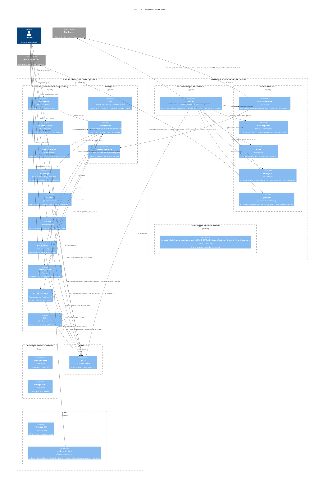

# C4 Component Diagram — CourseReader (Level 3)



## Component Groups

### React Views (10 components)

| Component | File | Responsibility |
|-----------|------|----------------|
| LandingView | `src/mainview/components/LandingView.tsx` | Welcome screen, pushes subjectList |
| SubjectListView | `src/mainview/components/SubjectListView.tsx` | Subject grid with module stats |
| ModuleListView | `src/mainview/components/ModuleListView.tsx` | Module cards, ← All Courses → subjectList |
| LessonPage | `src/mainview/App.tsx` (inline) | Header + ModuleSwitcher + LessonView layout |
| LessonView | `src/mainview/components/LessonView.tsx` | Markdown reader, section nav, AI sidebar, notes |
| QuizView | `src/mainview/components/QuizView.tsx` | MCQ quiz with scoring, API-backed |
| ReviewView | `src/mainview/components/ReviewView.tsx` | SRS spaced repetition review |
| SettingsView | `src/mainview/components/SettingsView.tsx` | Gemini API key, theme grid, font size |
| BookmarksView | `src/mainview/App.tsx` (inline) | Bookmark list with open/delete |
| Sidebar | `src/mainview/components/Sidebar.tsx` | Section nav, notes, highlights, AI panel |

### State Management (2 stores)

| Component | File | Responsibility |
|-----------|------|----------------|
| useViewStore | `src/mainview/stores/viewStore.ts` | View stack: push/pop/replace/popToRoot |
| useSettingsStore | `src/mainview/stores/settingsStore.ts` | Font size (10-28px), theme (8 options) |

### API & Hooks

| Component | File | Responsibility |
|-----------|------|----------------|
| api.ts | `src/mainview/api.ts` | fetch() wrapper for all backend endpoints |
| useBookmarks | `src/mainview/hooks/useBookmarks.ts` | Bookmark CRUD hook |
| useHighlights | `src/mainview/hooks/useHighlights.ts` | Highlights CRUD hook |

### Backend Services (6 modules)

| Component | File | Responsibility |
|-----------|------|----------------|
| index.ts (Router) | `src/bun/index.ts` | Bun.serve, all API route handlers, window creation |
| course-loader.ts | `src/bun/course-loader.ts` | File I/O: load subjects, lessons, quizzes; YAML parse |
| quiz-engine.ts | `src/bun/quiz-engine.ts` | QuizEngine class: state machine for MCQ flow |
| srs.ts | `src/bun/srs.ts` | SM-2 filter: getDue, getStarred, toggleStar |
| storage.ts | `src/bun/storage.ts` | JSON persistence: ~/.coursereader/data.json |
| gemini.ts | `src/bun/gemini.ts` | Gemini 2.0 Flash API client |

### Models (src/bun/types.ts)

| Interface | Description |
|-----------|-------------|
| Subject | Subject metadata + modules array |
| ModuleMeta | Module name, time, prerequisites, topics |
| QuizQuestion | MCQ question with options + answer |
| SRSCard | SM-2 card: easeFactor, interval, repetitions |
| SRSDeck | Card collection (Record<string, SRSCard>) |
| ModuleSection | Heading-based section (id, heading, level) |
| Highlight | Selected text highlight with color |
| Note | User note attached to highlight/section |
| Bookmark | Bookmarked position in lesson |

## Navigation Flow

```
landing → subjectList
subjectList → moduleList (select subject)
moduleList → lesson (select module)
moduleList → subjectList (← All Courses, replace)
lesson → moduleList (← back, replace)
lesson → lesson (switch module via ModuleSwitcher)
lesson → quiz (push)
lesson → review (push)
lesson → settings (push)
lesson → bookmarks (push)
quiz → previous view (pop)
review → previous view (pop)
settings → previous view (pop)
bookmarks → lesson (replace, on open), previous view (pop, on back)
```

## Data Flow

```
Student → View Component → api.ts (fetch) → Bun HTTP server → Services → File System / Gemini API
                              ↑                                            ↓
                              └──────────── JSON response ────────────────┘
```

- **View → Store**: Read/write Zustand state (view stack, settings)
- **View → API**: fetch() to localhost:50001 for all data operations
- **Backend → Services**: Route handler calls course-loader, quiz-engine, srs, storage, gemini
- **Services → File System**: read/write subjects/ directory tree, ~/.coursereader/
- **Response → View**: JSON returned, React re-renders
