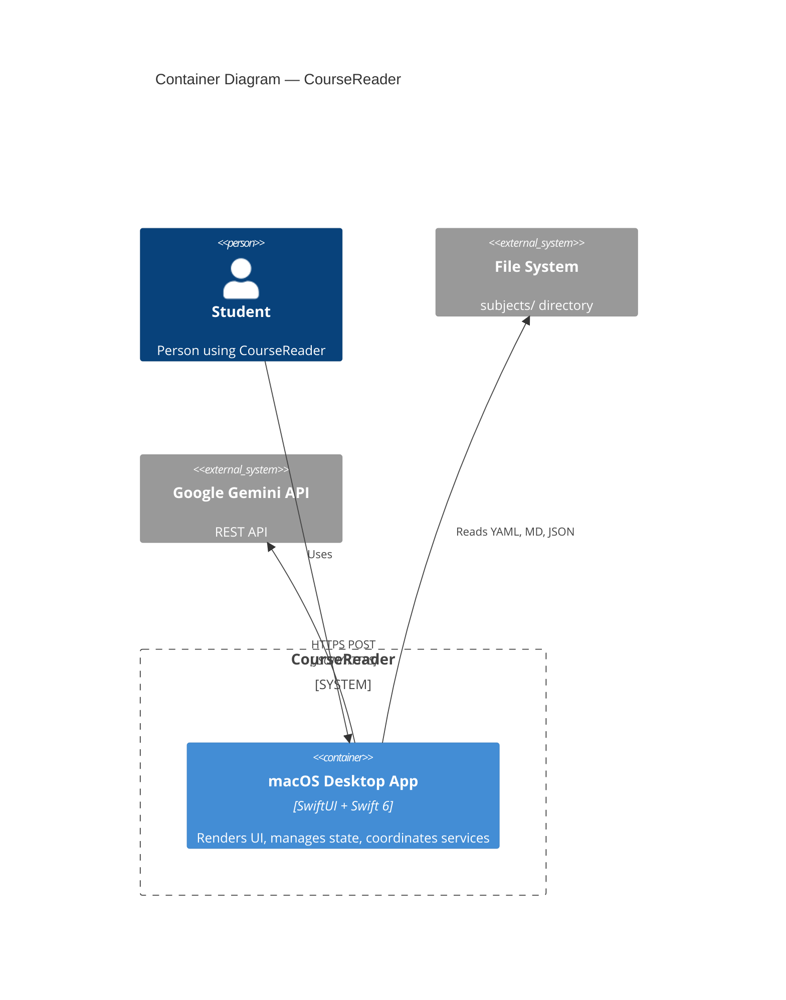

# C4 Container Diagram — CourseReader (Level 2)

## Elements

| Element | Type | Technology | Description |
|---------|------|------------|-------------|
| macOS Desktop App | Container | SwiftUI, Swift 6, macOS 15+ | Single desktop application — no server, no web UI |
| File System | External | Local disk | Course data in `subjects/<id>/` |
| Google Gemini API | External | REST/HTTPS | AI-powered Q&A on course content |

## Notes

- Single-container architecture. No backend, no database, no web layer.
- All data is local file I/O from `subjects/` directory.
- Only external dependency is Gemini API (optional, only when AI feature used).
