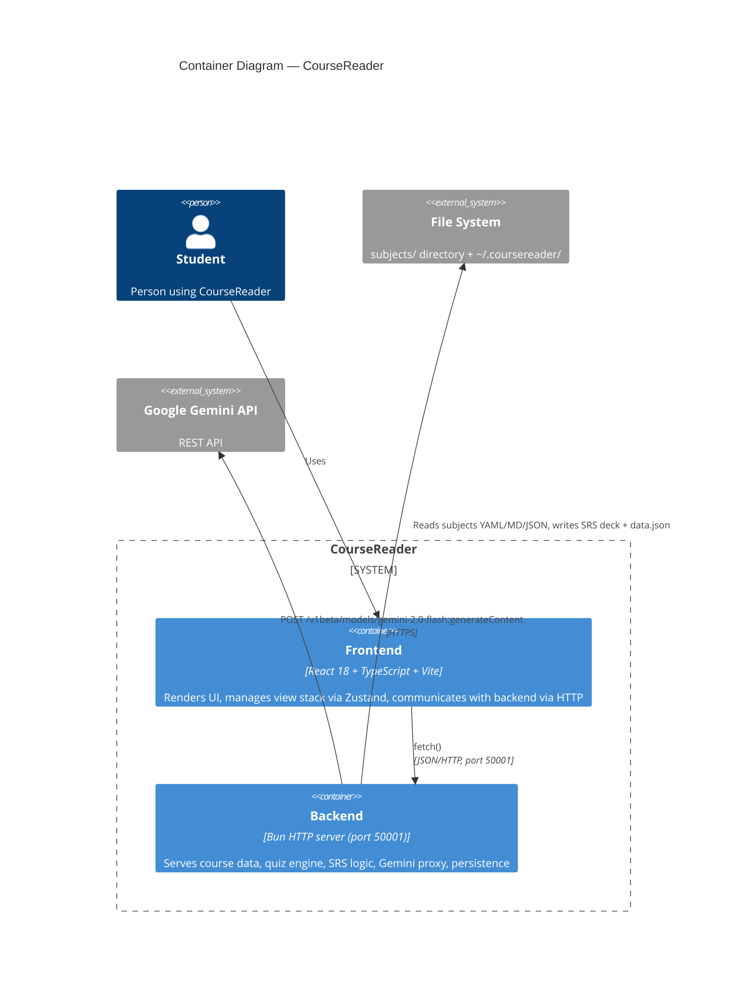

# C4 Container Diagram — CourseReader (Level 2)

## Elements

| Element | Type | Technology | Description |
|---------|------|------------|-------------|
| Frontend | Container | React 18, TypeScript, Vite, Zustand | Renders UI in Electrobun webview. View stack routing, Tailwind CSS, react-markdown |
| Backend | Container | Bun HTTP server, port 50001 | All API handlers: subjects, lessons, quizzes, SRS, storage. Gemini proxy |
| File System | External | Local disk | Course data in `subjects/<id>/`, prefs in `~/.coursereader/` |
| Google Gemini API | External | REST/HTTPS | AI-powered Q&A on course content |

## Notes

- Two-container architecture: frontend (Electrobun webview) + backend (Bun HTTP server)
- All data is local file I/O on backend side. Frontend has no direct file access.
- Only external dependency is Gemini API (optional, only when AI feature used).
