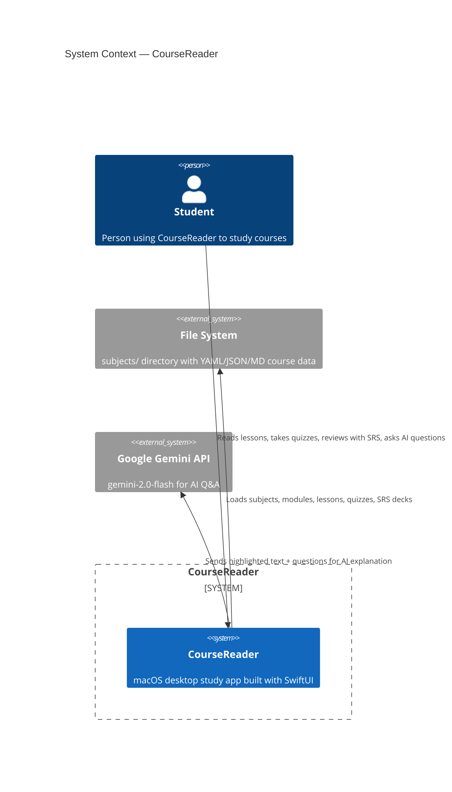

# C4 Context Diagram — CourseReader (Level 1)

## Elements

| Element | Type | Description |
|---------|------|-------------|
| Student | Person | End user who studies course material |
| CourseReader | System | macOS SwiftUI app (this project) |
| File System | External System | Local `subjects/` directory tree |
| Google Gemini API | External System | `generativelanguage.googleapis.com` |

## Relationships

- Student → CourseReader: reads lessons, takes quizzes, reviews SRS cards, asks AI
- CourseReader → File System: reads syllabus YAML, lesson MD, quiz YAML, SRS JSON
- CourseReader → Gemini API: POST requests with course context + student question
