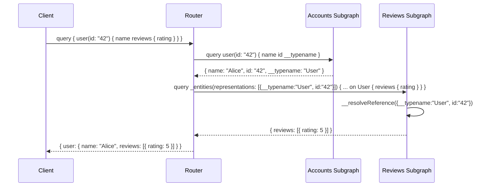

# Module 14: Federation Entity Composition

Est. study time: 2.5h
Language: en

## Learning Objectives
- Understand entities and @key as primary keys spanning subgraphs
- Use @external, @requires, @provides for cross-subgraph field dependencies
- Implement __resolveReference entity resolvers
- Distinguish value types from entity types
- Analyze entity resolution flow across subgraph chain

---

## Core Content

### Entities and @key

Entity = type whose identity spans multiple subgraphs. `@key` defines primary key fields that uniquely identify entity across subgraphs.

```graphql
# Accounts subgraph — defines User entity
type User @key(fields: "id") {
  id: ID!
  name: String!
  email: String!
}

# Reviews subgraph — extends User entity
type User @key(fields: "id") {
  id: ID!
  reviews: [Review!]!
}
```

Both subgraphs declare `User` as entity via `@key(fields: "id")`. Composition merges into single `User` type with all fields.

> **Think**: Can an entity have multiple @key directives?
>
> *Answer: Yes. Federation 2 supports multiple @key directives on same type for different lookup strategies. Example: `type User @key(fields: "id") @key(fields: "email")` can be resolved by either id or email. Router chooses based on query context.*

---

### @external Field

Field defined in another subgraph. Subgraph knows field exists but does not resolve it.

```graphql
# Payments subgraph — needs User.email but Accounts resolves it
type User @key(fields: "id") {
  id: ID! @external
  email: String! @external  # Defined by Accounts, but Payments needs it
  payments: [Payment!]!
}
```

@external tells composition: "this field exists somewhere else, I'm just referencing it."

> **Think**: What happens if you forget @external on a field that another subgraph defines?
>
> *Answer: Composition fails with duplicate field error. Federation enforces single-ownership unless @shareable. @external explicitly waives ownership. Without it, composition sees two subgraphs claiming ownership of same field — conflict.*

---

### @requires Field

Entity resolver needs data from another subgraph before resolving. @requires declares dependency.

```graphql
# Shipping subgraph
type Product @key(fields: "sku") {
  sku: ID! @external
  weight: Float! @external
  shippingCost: Float! @requires(fields: "weight")
}
```

Router must fetch `weight` from product-owning subgraph before shipping subgraph can compute `shippingCost`.

> **Think**: Does @requires always trigger a subgraph call?
>
> *Answer: Only if the required fields aren't already in the query context. If client already requested `weight` (fetched from Products subgraph), router passes it to Shipping. If not, router fetches weight first, then calls Shipping subgraph. @requires creates sequential dependency — avoid in latency-sensitive paths.*

---

### @provides Field

Field that a subgraph can resolve without calling another subgraph, even though it's declared as @external.

```graphql
# Reviews subgraph — can resolve Product.name from local data
type Product @key(fields: "upc") {
  upc: String! @external
  name: String! @provides(fields: "name")  # Resolvable without Products subgraph
  reviews: [Review!]
}

extend type Query {
  topRatedProducts: [Product!]! @provides(fields: "name")
}
```

@provides optimizes: router skips subgraph call for provided fields.

> **Think**: When would a subgraph "provide" a field it doesn't own?
>
> *Answer: When subgraph has local copy or can compute the field. Example: Reviews subgraph joins Product.name at write-time in its own DB. No need to call Products subgraph during query. @provides is performance optimization — trade storage/consistency for latency.*

---

### Entity Resolvers: __resolveReference

Each subgraph that extends an entity must implement `__resolveReference` — tells router how to fetch entity by @key.

```python
# Python example (resolver pattern same across languages)
def resolve_user_reference(reference, context):
    # reference = {"__typename": "User", "id": "42"}
    user_id = reference["id"]
    user = db.users.find_by_id(user_id)
    return user
```

```javascript
// Apollo Server entity resolver
const resolvers = {
  User: {
    __resolveReference(ref) {
      return db.users.findByPk(ref.id);
    }
  }
};
```

Router flow:
1. Client queries `{ user(id: "42") { name reviews { rating } } }`
2. Router determines: User.name from Accounts, User.reviews from Reviews
3. Router calls Accounts with `query { user(id: "42") { name __typename id } }`
4. Accounts returns User entity with `id: "42"`
5. Router calls Reviews: `query { _entities(representations: [{__typename: "User", id: "42"}]) { ... on User { reviews { rating } } } }`
6. Reviews' `__resolveReference` looks up user's reviews

> **Think**: Why does router include `__typename` in step 3?
>
> *Answer: Router needs `__typename` to build the entity representation object `{__typename: "User", id: "42"}` sent to other subgraphs. Without type name, destination subgraph doesn't know which entity type's __resolveReference to call.*

---

### Reference Resolution Flow



Steps:
1. Router parses query, builds plan
2. Resolve root fields from owning subgraph (Accounts)
3. Extract entity representations (type + key fields)
4. Call dependent subgraphs (Reviews) with `_entities` query
5. Each subgraph's `__resolveReference` fetches additional data
6. Router merges results into single response

> **Think**: What happens if Reviews subgraph is down during this query?
>
> *Answer: Router returns partial data if configured for partial results: `user.name` from Accounts succeeds, `user.reviews` returns null or error. Client sees partial response. Router can be configured to fail entire query on any subgraph failure (strict mode).*

---

### Value Types vs Entity Types

| Aspect | Value Type | Entity Type |
|--------|-----------|-------------|
| Has @key | No | Yes |
| Identity | No independent existence | Globally identifiable |
| Owned by | One subgraph | Multiple subgraphs |
| Example | Address, Money, Rating | User, Product, Order |
| Subgraph scope | Single subgraph | Cross-subgraph |

```graphql
# Value type — only in Accounts subgraph
type Address {
  street: String!
  city: String!
  zip: String!
}

# Entity type — shared across subgraphs
type User @key(fields: "id") {
  id: ID!
  address: Address!  # Value type embedded in entity
}
```

Value types never appear in `_entities` queries. They're resolved inline by owning subgraph.

> **Think**: Can two subgraphs define the same value type name with different fields?
>
> *Answer: Yes, but composition treats them as separate types internally. If fields match, router merges them. If they differ, router generates distinct names or composition fails depending on conflict. Best practice: value types are single-subgraph-only. If type needs cross-subgraph, make it entity with @key.*

---

### Why This Matters

Entity composition is federation's core mechanism. Without entities, subgraphs would be isolated silos — no cross-subgraph queries possible. @key, @external, @requires, @provides form the language for expressing cross-subgraph data relationships. Understanding entity resolution flow is essential for debugging performance: every __resolveReference call is a network round-trip between router and subgraph.

---

## Examples

### Example 1: User Entity Across 3 Subgraphs

**Accounts subgraph:**
```graphql
type User @key(fields: "id") {
  id: ID!
  name: String!
  email: String!
}
```

**Reviews subgraph:**
```graphql
type User @key(fields: "id") {
  id: ID! @external
  reviews: [Review!]!
}
```

**Payments subgraph:**
```graphql
type User @key(fields: "id"){
  id: ID! @external
  email: String! @external
  @requires(fields: "email")
  paymentMethods: [PaymentMethod!]!
}
```

Client query: `{ user(id: "42") { name reviews { rating } paymentMethods { last4 } } }`

Router plan:
1. Accounts: resolve `user(id: 42)` → get `name`, `id`, `__typename`
2. Reviews: `_entities` with `{__typename: "User", id: "42"}` → `reviews`
3. Payments: `_entities` with `{__typename: "User", id: "42", email: "alice@..."}` → `paymentMethods`

---

### Example 2: @requires Chain

```graphql
# Products subgraph
type Product @key(fields: "sku") {
  sku: ID!
  weight: Float!
  dimensions: Dimensions!
}

type Dimensions { length: Float! width: Float! height: Float! }

# Shipping subgraph
type Product @key(fields: "sku") {
  sku: ID! @external
  weight: Float! @external
  dimensions: Dimensions! @external
  shippingVolume: Float! @requires(fields: "weight dimensions { length width height }")
}
```

Query `{ product(sku: "XYZ") { weight shippingVolume } }`:
1. Router calls Products: `product(sku: "XYZ") { weight dimensions { length width height } sku __typename }`
2. Router calls Shipping: `_entities({__typename: "Product", sku: "XYZ", weight: 2.5, dimensions: {length: 10, width: 5, height: 3}}) { shippingVolume }`
3. Shipping computes `shippingVolume = length * width * height` without calling Products again (router provided nesting)

---

## Key Takeaways
- @key defines entity identity across subgraphs; entities enable cross-subgraph type sharing
- @external declares field owned elsewhere; @requires declares field dependency chain
- @provides optimizes by declaring locally-resolvable external fields
- __resolveReference resolves entity by key fields — every extending subgraph must implement it
- Router builds query plan: resolve root subgraph first, then entity references to other subgraphs
- @requires creates sequential subgraph calls — avoid in hot paths
- Value types are single-subgraph; entity types are cross-subgraph

---

## Common Misconception

**"Entity types are like foreign keys in a relational database."**

Superficially similar but architecturally different. Foreign keys in SQL enable joins at query time across tables. @key enables entity resolution across network boundaries — each subgraph is a separate service with its own database. There is no shared database, no cross-subgraph JOIN, no direct table access. The router performs the "join" by orchestrating subgraph calls, but each subgraph resolves its portion independently. @key is a service-boundary primitive, not a data-modeling primitive.

---

## Feynman Explain

Explain entities, @key, and __resolveReference to a backend engineer who knows REST microservices and inter-service communication patterns. Focus on: how __resolveReference is analogous to a "GET /users/:id" endpoint but for GraphQL type resolution, and why entity resolution requires two-phase: root fetch + reference resolution. Max 3 sentences per concept.

*When ready, say explanation aloud or write it down. Then run `learn.sh explain graphql-deep-dive 14` — AI will probe your explanation for gaps.*

---

## Reframe

Critique: "Entity composition turns one GraphQL query into N+1 subgraph requests (1 root query + N entity resolution calls)." Is the convenience of cross-subgraph querying worth the network overhead? When should entity composition be avoided in favor of client-side orchestration (client makes N queries)? What query patterns trigger dangerously deep resolve chains?

---

## Drill

Take the quiz. MCQs test entity resolution flow, @key variants, @external/@requires/@provides usage.

Run: `learn.sh quiz graphql-deep-dive 14`
