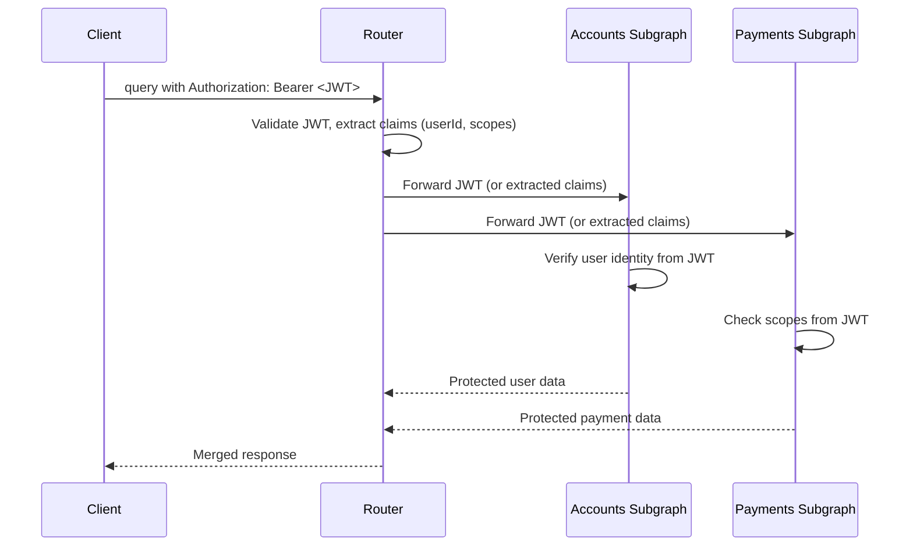

# Module 15: Federation Cross-Cutting

Est. study time: 2.5h
Language: en

## Learning Objectives
- Implement auth in federated graph using @authenticated, @requiresScopes, JWT propagation
- Handle partial subgraph failure and error propagation to clients
- Apply schema governance with change validation and breaking change detection
- Use strangler fig pattern for gradual monolith-to-federation migration
- Optimize query planning and subgraph call batching for performance
- Test federated graph with contract tests and integration tests

---

## Core Content

### Authentication in Federated Graph

Federation provides cross-cutting auth directives at supergraph level:

```graphql
extend type Query {
  adminDashboard: Dashboard! @authenticated
}

type Mutation {
  deleteUser(id: ID!): Boolean! @authenticated @requiresScopes(scopes: ["admin"])
}

type User @key(fields: "id") {
  id: ID!
  ssn: String! @inaccessible  # Hidden from supergraph entirely
  email: String!              # Accessible to authenticated users only via router policy
}
```

**JWT flow across subgraphs:**



Router validates JWT once. Can forward raw JWT to subgraphs or inject extracted claims into subgraph context (e.g., `X-User-ID`, `X-Scopes` headers).

> **Think**: Router validates JWT. Why should subgraphs also validate?
>
> *Answer: Defense in depth. Subgraphs might be accessed directly (non-federated path). Router validation prevents unauthorized requests at gateway level; subgraph validation catches internal misuse. Also, router may be misconfigured — trust no single layer.*

---

**@authenticated** — requires valid JWT (any authenticated user).
**@requiresScopes** — requires specific OAuth2 scopes.

```graphql
type Mutation @authenticated {
  # All mutations require auth
  createPost(input: CreatePostInput!): Post!
  deletePost(id: ID!): Boolean!
}

type Query {
  publicFeed: [Post!]!
  adminStats: Stats! @requiresScopes(scopes: ["admin"])
}
```

> **Think**: @requiresScopes("admin") — does router check scopes or subgraph?
>
> *Answer: Router checks scopes before forwarding to subgraph. If client lacks scopes, router rejects without calling subgraph. Better latency (fail fast) and security (subgraph never touched by unauthorized request). Subgraph still validates as defense layer.*

---

### Error Handling: Partial Subgraph Failure

Subgraphs fail independently. Router must decide: fail all or return partial data?

```json
// Partial success response
{
  "data": {
    "user": {
      "name": "Alice",
      "reviews": null
    }
  },
  "errors": [
    {
      "message": "Reviews subgraph returned an error",
      "path": ["user", "reviews"],
      "extensions": {
        "code": "SUBGRAPH_ERROR",
        "service": "reviews"
      }
    }
  ]
}
```

**Router error modes:**

| Mode | Behavior | Use case |
|------|----------|----------|
| `partial` | Return successful subgraph data, null for failed | Dashboard where partial data acceptable |
| `strict` | Fail entire request if any subgraph fails | Transactional queries where partial data misleading |
| `custom` | Router Rhai/WASM plugin custom logic | Complex error handling per type |

Subgraph error propagation. Subgraphs return errors in standard GraphQL error format. Router includes them in response with subgraph identifier.

> **Think**: Bank transfer query reads from Accounts (balance) and Payments (transfer status). Which error mode?
>
> *Answer: Strict mode. Showing account balance but failing to show transfer status is misleading — user might think transfer didn't happen. Partial would be dangerous. For read-only dashboards, partial is fine.*

---

### Schema Governance

Breaking change detection prevents schema modifications that break existing clients.

```bash
# CI pipeline step
rover subgraph check my-graph@current \
  --name accounts \
  --schema ./accounts/schema.graphql
```

**Breaking changes detected:**
- Removing a field or type
- Making a non-null field nullable (clients expect String!, get null → crash)
- Removing a value from enum
- Changing field type
- Adding required argument to existing field
- Removing @key from entity

**Safe changes:**
- Adding new type or field
- Adding optional argument
- Making nullable field non-null (if always non-null at runtime)
- Adding new enum value
- Adding @shareable to existing field

```yaml
# .graphqlrc.yml — schema governance config
schema:
  - ./subgraphs/*/schema.graphql
extensions:
  apollo:
    graph: my-graph
    variant: current
    validation:
      rules:
        - no-breaking-changes
        - no-inaccessible-type-count-increase
```

> **Think**: Why is removing an enum value breaking but adding one is safe?
>
> *Answer: Client code may switch on enum values. Removing a value means existing client code references a value that no longer exists → runtime error. Adding a new value: existing client code doesn't reference it → no breakage. Enum stability is critical for GraphQL schemas.*

---

### Gradual Adoption: Strangler Fig Pattern

Migrate monolith to federation without rewriting everything:

```
Phase 1: Monolith
[Client] → [Monolith GraphQL]

Phase 2: Coexistence
[Client] → [Router] → [Monolith (as subgraph)]

Phase 3: Extract first subgraph
[Client] → [Router] → [Monolith + Accounts Subgraph]
                        Router: User queries → Accounts
                        Everything else → Monolith

Phase 4: Extract more
[Client] → [Router] → [Accounts + Products + Orders + Monolith rest]

Phase 5: Full migration
[Client] → [Router] → [Accounts + Products + Orders + Reviews]
                        (Monolith gone)
```

Key principle: router delegates simple queries to new subgraphs, complex queries to monolith. Gradually shift boundaries.

```graphql
# Phase 2: Router config routes User queries to Monolith
# Phase 3: Change Router config — User queries to Accounts subgraph
# No client changes needed
```

> **Think**: During phase 3, how do you ensure data consistency between monolith and new Accounts subgraph?
>
> *Answer: Dual-write during migration. Writes go to both monolith and Accounts. Read from Accounts. After verification period, stop writing to monolith's user data. Rollback: switch Router back to monolith for User queries. No data loss.*

---

### Performance: Query Planning Overhead

Every federated query requires query planning — router must decide which subgraphs to call and in what order.

**Query planning cost:**
- Simple query (1 subgraph): ~100μs planning
- Cross-subgraph query (3 subgraphs): ~500μs planning
- Complex query with @requires chains: ~2ms planning

**Optimization techniques:**

1. **Cached query plans**: Same query → same plan. Cache by query shape.
```yaml
# Router config
limits:
  query_plan_cache_size: 1000  # Cache 1000 plans
```

2. **Subgraph call batching**: Router batches entity resolution.
```
Instead of N individual _entities calls for N users:
_entities(representations: [User:1, User:2, User:3]) { ... on User { name } }
```

3. **@provides**: Reduce subgraph hops by annotating locally-resolvable fields.

4. **Persisted queries**: Bypass query planning entirely for known queries.

> **Think**: 2ms query planning for a 100ms query — is it worth optimizing?
>
> *Answer: No — 2ms is 2% overhead. Optimize when query planning >10% of total latency. For high-throughput APIs (10k+ req/s), every microsecond matters. For typical APIs, focus on subgraph latency first — query planning usually isn't bottleneck.*

---

### Testing Federated Graph

**Subgraph contract tests**: each subgraph independently tested with contract (expected supergraph behavior).

```python
# Contract test for Accounts subgraph
def test_user_contract():
    """Accounts must satisfy User entity contract"""
    schema = load_schema("accounts/schema.graphql")
    
    # Assert @key exists
    assert has_directive(schema, "User", "key")
    
    # Assert required fields
    user_type = schema.get_type("User")
    assert "id" in user_type.fields
    assert "name" in user_type.fields
    
    # Assert __resolveReference works
    result = execute_query("""
        query { _entities(representations: [{__typename: "User", id: "1"}]) 
                { ... on User { name } } }
    """)
    assert result.data["_entities"][0]["name"] is not None
```

**Integration tests**: spin up router + all subgraphs (or mocks).

```python
def test_cross_subgraph_query():
    """User with reviews — spans 2 subgraphs"""
    result = router.execute("""
        query { user(id: "1") { name reviews { rating } } }
    """)
    assert result.data["user"]["name"] == "Alice"
    assert len(result.data["user"]["reviews"]) > 0
```

**Contract testing tools:**
- Apollo Studio: schema checks + operation checks
- GraphQL-Inspector: schema diff and breaking change detection
- Custom: subgraph boundary validation scripts

> **Think**: What's the minimum viable federated graph test suite?
>
> *Answer: (1) Each subgraph must have contract tests for entity types it extends. (2) One integration test per cross-subgraph query. (3) Schema check in CI (rover subgraph check). This catches: missing @key, wrong __resolveReference, breaking changes, and major cross-subgraph failures.*

---

### Workflow: Isolated Dev vs Supergraph-First

**Isolated subgraph dev:** Each subgraph team develops independently using mock supergraph.

```
Dev A: works on Accounts subgraph with local supergraph compose
Dev B: works on Reviews subgraph with local supergraph compose
CI: integration test with all actual subgraphs
```
Pros: teams don't block each other. Cons: integration surprises.

**Supergraph-first:** All teams share a dev supergraph instance.

```
All devs: push schema → shared dev supergraph → test against real subgraphs
```
Pros: catches integration issues early. Cons: breaking changes affect everyone.

**Recommendation:** Hybrid. Isolated dev for local iteration. Supergraph-first for CI/CD. Staging supergraph mirrors production.

> **Think**: 10 teams each running local supergraph compose — how many Rufus instances?
>
> *Answer: 10 (one per team) but that's fine. Supergraph compose is lightweight (ms). CI runs 1 integration supergraph. The issue is schema drift between dev environments — teams may deploy schemas that look compatible locally but conflict in CI. Solution: contract tests that validate against published supergraph version.*

---

### Why This Matters

Federation's cross-cutting concerns determine whether it's viable in production. Auth, error handling, governance, migration, performance, testing — each is a potential failure point. Teams often succeed at federation design (Module 13) and entity composition (Module 14) but fail at cross-cutting. A perfectly composed supergraph is useless if auth leaks data across subgraphs, or migration breaks existing queries, or performance degrades under load.

---

## Examples

### Example 1: Auth Propagation Policy

```yaml
# Router YAML config
authentication:
  jwt:
    jwks_url: https://auth.example.com/.well-known/jwks.json
    claims:
      - key: sub
        source: subgraph
        header: X-Auth-User-Id
    require_auth: true

authorization:
  requires_authentication: true
  scopes:
    header: X-Auth-Scopes
    required: false

headers:
  all_rules:
    - action: forward
      name: Authorization
    - action: insert
      name: X-Auth-User-Id
      value_from: jwt.sub
    - action: insert
      name: X-Auth-Scopes
      value_from: jwt.scopes
```

Each subgraph receives `X-Auth-User-Id` and `X-Auth-Scopes` headers. Subgraphs trust these headers (router-to-subgraph channel is secured).

---

### Example 2: Migration Strangler Fig — Actual Configs

**Phase 2 (Monolith as subgraph):**
```yaml
# supergraph.yaml
subgraphs:
  monolith:
    routing_url: http://monolith/graphql
    schema:
      file: ./schemas/monolith.graphql
```

**Phase 3 (Extract Accounts):**
```yaml
subgraphs:
  accounts:
    routing_url: http://accounts/graphql
    schema:
      file: ./schemas/accounts.graphql
  monolith:
    routing_url: http://monolith/graphql
    schema:
      file: ./schemas/monolith.graphql
```

Router checks query — if User fields, route to `accounts`. If other fields, route to `monolith`. No monolith code changes needed.

---

## Key Takeaways
- @authenticated and @requiresScopes enforce auth at router level; subgraphs validate as defense layer
- Partial subgraph failure configurable: partial mode for dashboards, strict mode for transactional queries
- Schema governance with rover subgraph check catches breaking changes before deploy
- Strangler fig pattern migrates monolith to federation without rewrite — dual-write for data consistency
- Query planning overhead < 10% of latency in most cases; cache plans and use @provides for optimization
- Test each subgraph independently (contract tests) + integration tests for cross-subgraph queries
- Hybrid workflow: isolated local dev, supergraph-first CI/CD, staging mirrors production

---

## Common Misconception

**"Federation handles auth — I don't need auth in subgraphs."**

Wrong. Router-level auth is convenience, not security boundary. Subgraphs must independently validate auth for defense in depth. Router might be bypassed (direct subgraph access for debugging), misconfigured (wrong JWT validation), or compromised (attacker controls router). Each subgraph should treat incoming requests as untrusted and verify claims. JWT validation in every subgraph is cheap; a data breach from missing subgraph auth is expensive.

---

## Feynman Explain

Explain federated auth, error propagation, and strangler fig migration to a backend engineer who knows monolithic GraphQL. Focus on: why JWT must be validated at both router and subgraph, how partial error mode differs from REST API error handling, and why strangler fig lets you migrate without "the big rewrite." Max 3 sentences per concept.

*When ready, say explanation aloud or write it down. Then run `learn.sh explain graphql-deep-dive 15` — AI will probe your explanation for gaps.*

---

## Reframe

Critique: "Federation cross-cutting concerns (auth, error handling, governance) add so much complexity that a simpler architecture would be more reliable." Is federation's cross-cutting complexity justified? When does the governance overhead of schema checks, contract tests, and auth propagation outweigh the benefit of team autonomy? Could a well-structured monolith with strict code ownership rules achieve the same organizational decoupling with less operational complexity?

---

## Drill

Take the quiz. MCQs test auth, error handling, governance, migration, performance, testing, and workflow tradeoffs.

Run: `learn.sh quiz graphql-deep-dive 15`
