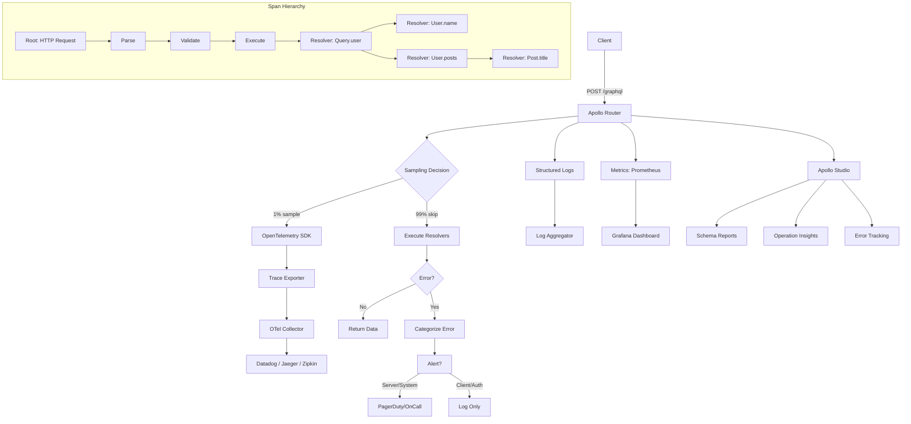

# Module 19: Observability

Est. study time: 2.5h
Language: en

## Learning Objectives
- Implement distributed tracing across GraphQL resolver chains using OpenTelemetry
- Configure Apollo Studio for schema reporting, operation metrics, and error tracking
- Design structured logging with correlation IDs and field-level latency tracking

---

## Core Content

### Tracing: Apollo Studio

Apollo Studio provides managed observability for GraphQL. It ingests traces from running gateways/routers and surfaces:

- **Schema reports** — automatic schema registration on deploy, change history, field usage stats
- **Operation metrics** — request rate, latency histograms, error percentage per operation
- **Error tracking** — categorized by error code, operation, field path
- **Performance insights** — slow fields, N+1 detection, cache efficiency

```graphql
# Apollo Router emits traces automatically when configured:
# -- apollo-router -s supergraph.graphql --config router.yaml
# router.yaml enables Studio reporting:
#
# telemetry:
#   apollo:
#     endpoint: "https://studio.apollographql.com"
#     api_key: "${APOLLO_KEY}"
#     graph_ref: "my-graph@current"
#     field_level_instrumentation: true
```

Every GraphQL operation becomes a trace. Each resolver call within that operation becomes a child span.

> **Think**: Apollo Studio reports every field and every error to the cloud. What privacy or compliance concerns might this raise?
>
> *Answer: PII in query variables, field arguments, or error messages leaks to external service. Solutions: redact variables via `@redact` directive, configure sampling to 1-10% in production, or use Apollo Studio's on-premise variant for regulated industries.*

---

### OpenTelemetry: Spans per Resolver

OpenTelemetry (OTel) is the vendor-neutral observability framework. In GraphQL, each resolver becomes a span:

```
Operation "GET /graphql" ──────────────────────────────────────
  ├─ root span: "POST /graphql" (HTTP request)
  │   ├─ graphql.query.parse
  │   ├─ graphql.query.validate
  │   ├─ graphql.query.execute
  │   │   ├─ resolver: Query.user (1.2ms)
  │   │   │   ├─ resolver: User.name (0.1ms)
  │   │   │   ├─ resolver: User.posts (8.3ms)
  │   │   │   │   ├─ resolver: Post.title (0.1ms)
  │   │   │   │   ├─ resolver: Post.body (0.1ms)
  │   │   │   │   └─ resolver: Post.comments (3.1ms)
  │   │   │   └─ resolver: User.email (0.1ms)
  │   │   └─ graphql.query.execute.total (14.7ms)
```

```typescript
// OTel span wrapping for resolvers:
import { trace } from '@opentelemetry/api';

const tracer = trace.getTracer('graphql-resolvers');

const resolvers = {
  Query: {
    user: async (_, { id }, context) => {
      return tracer.startActiveSpan('resolver: Query.user', async (span) => {
        span.setAttribute('graphql.field', 'Query.user');
        span.setAttribute('graphql.argument.id', id);
        try {
          const user = await context.db.users.findUnique({ where: { id } });
          span.setAttribute('db.user_id', user?.id);
          return user;
        } finally {
          span.end();
        }
      });
    },
  },
};
```

Parent-child relationships follow resolver nesting automatically when spans are created inside resolvers called by the parent resolver.

> **Think**: How does async resolver resolution affect span parent-child relationships?
>
> *Answer: If child resolvers await promises created after the parent span ends, the parent-child relationship breaks. Solutions: (1) keep parent span alive until all children complete via Promise.all, (2) use OTel context propagation to link spans even across async boundaries.*

---

### Structured Logging in Resolvers

Plain `console.log` is unacceptable in production. Structured logging emits JSON with consistent keys:

```typescript
import { createLogger } from './logger';

const logger = createLogger({ service: 'graphql', version: '1.0.0' });

const resolvers = {
  Query: {
    search: async (_, { query, limit }, context) => {
      const correlationId = context.headers['x-correlation-id'] ?? crypto.randomUUID();
      logger.info('search initiated', {
        correlationId,
        query,
        limit,
        userId: context.user?.id,
      });

      try {
        const results = await searchService.search(query, limit);
        logger.info('search completed', {
          correlationId,
          resultCount: results.length,
          latencyMs: results.latency,
        });
        return results;
      } catch (err) {
        logger.error('search failed', {
          correlationId,
          error: err.message,
          stack: err.stack,
        });
        throw err;
      }
    },
  },
};
```

**Correlation IDs**: generate at request ingress, pass through all resolvers, include in log output and error responses. Enables joining logs across microservices.

> **Think**: Should correlation IDs be exposed to the GraphQL client?
>
> *Answer: Yes — return correlation ID in response extensions (`extensions: { correlationId: "abc-123" }`). Client includes it in support tickets. Server-side, log it everywhere. Never expose internal correlation IDs that reveal topology.*

---

### Metrics: Request Rate, Latency, Field-Level

Metrics supplement traces. Three tiers:

| Metric | What | How |
|--------|------|-----|
| Request rate | Operations/second | Prometheus counter, label by operationName |
| Error rate | Failed operations / total | Counter with `error: true` label |
| Latency | p50/p95/p99 in ms | Histogram, label by operationName |
| Field latency | Per-resolver duration | Histogram, label by typeName.fieldName |

```typescript
// Prometheus metrics in resolvers:
import { Counter, Histogram } from './metrics';

const requestCounter = new Counter('graphql_requests_total', ['operation', 'status']);
const latencyHistogram = new Histogram('graphql_resolver_duration_ms', ['type', 'field']);

const resolvers = {
  Query: {
    products: async (_, args, context) => {
      const timer = latencyHistogram.startTimer({ type: 'Query', field: 'products' });
      try {
        const result = await productsService.findAll(args);
        requestCounter.inc({ operation: 'products', status: 'success' });
        return result;
      } catch (err) {
        requestCounter.inc({ operation: 'products', status: 'error' });
        throw err;
      } finally {
        timer.end();
      }
    },
  },
};
```

Prometheus scrapes these endpoints. Grafana dashboards visualize operation health per deploy version.

> **Think**: Why measure field-level latency instead of just operation-level?
>
> *Answer: Field-level isolates which resolver is slow. A 5s operation could be one slow resolver or many moderately slow resolvers. Field-level latency pinpoints the bottleneck without digging through traces.*

---

### Error Tracking: Categorizing Errors

Not all GraphQL errors are equal. Categorize by source:

| Category | Source | Examples | Action |
|----------|--------|----------|--------|
| Client error | Invalid input, bad query | Validation errors, missing fields | Log + return error. Don't alert. |
| Server error | Internal failure | DB timeout, 3rd party outage | Alert. Investigate. |
| Auth error | Permission denied | Unauthenticated, role mismatch | Log. Alert if frequent (attack?). |
| System error | Infrastructure | OOM, network partition | Alert immediately. Pager. |

```typescript
function categorizeError(error: GraphQLError): ErrorCategory {
  if (error.originalError instanceof ValidationError) return 'CLIENT';
  if (error.originalError instanceof AuthenticationError) return 'AUTH';
  if (error.originalError instanceof DatabaseError) return 'SERVER';
  if (error.originalError?.message?.includes('ETIMEDOUT')) return 'SERVER';
  return 'SYSTEM';
}

const formatError: FormatErrorFn = (formattedError, error) => {
  const category = categorizeError(error);
  return {
    ...formattedError,
    extensions: {
      ...formattedError.extensions,
      category,
      errorCode: error.originalError?.code ?? 'UNKNOWN',
      // Never expose stack traces in production:
      ...(process.env.NODE_ENV === 'development' && { stack: error.originalError?.stack }),
    },
  };
};
```

> **Think**: What's the risk of returning stack traces in GraphQL error extensions?
>
> *Answer: Stack traces leak code paths, library versions, file paths, internal IPs. Attackers use this to identify vulnerable dependencies. Always strip stacks in production. Use error IDs that reference an internal log store.*

---

### Tracing Every Resolver vs Sampling

Tracing every resolver is expensive. Three strategies:

| Strategy | Overhead | Visibility | Best for |
|----------|----------|------------|----------|
| **Head-based** (1%) | Low | Always-on, probabilistic | High-traffic prod |
| **Tail-based** (>5% + conditions) | Moderate | Captures slow/error traces regardless of rate | Systems needing p99 visibility |
| **Dynamic** (100% for problematic operations) | Variable | Full visibility on demand | Debugging environment |

```yaml
# Dynamic sampling: trace all operations with error rate > 5%
telemetry:
  apollo:
    sampling:
      # Always sample errors:
      error_percentage: 100
      # Sample 1% of successful operations:
      regular_percentage: 1
      # Trace operations matching regex:
      match: ".*(admin|dashboard).*"
```

Head-based is standard. Tail-based requires buffer — traces stored temporarily then decision made based on result status.

> **Think**: Why would you need 100% tracing for some operations?
>
> *Answer: Infrequently called but critical operations (e.g., billing, account deletion) need full trace coverage even at low traffic. Sampling would miss their rare failures. Set per-operation sampling rules via operation name match.*

---

### Custom Extensions for Performance Data

Attach performance metadata to the response `extensions` field:

```typescript
const server = new ApolloServer({
  typeDefs,
  resolvers,
  plugins: [
    {
      async requestDidStart() {
        const startTime = Date.now();
        const resolverTimings = new Map();

        return {
          async executionDidStart() {
            return {
              willResolveField({ info }) {
                const fieldPath = `${info.parentType.name}.${info.fieldName}`;
                const start = Date.now();
                return () => {
                  const duration = Date.now() - start;
                  resolverTimings.set(fieldPath, (resolverTimings.get(fieldPath) ?? 0) + duration);
                };
              },
            };
          },
          async willSendResponse({ response }) {
            response.extensions = {
              ...response.extensions,
              performance: {
                totalMs: Date.now() - startTime,
                resolvers: Object.fromEntries(resolverTimings),
              },
            };
          },
        };
      },
    },
  ],
});
```

Response:

```json
{
  "data": { ... },
  "extensions": {
    "performance": {
      "totalMs": 14.2,
      "resolvers": {
        "Query.user": 1.1,
        "User.posts": 8.2,
        "Post.comments": 3.0
      }
    }
  }
}
```

---



### Why This Matters

Without observability, GraphQL is a black box. REST gives you URL-level metrics out of the box. GraphQL collapses all endpoints into one, making field-level visibility mandatory. Tracing, logging, and metrics are not optional for production GraphQL — they are survival tools. Apollo Studio and OpenTelemetry turn a monolith endpoint into a debuggable, measurable system.

---

## Examples

### Example 1: OTel Instrumentation with Parent-Child Span Tracking

```typescript
import { trace, context, Span } from '@opentelemetry/api';
import { db } from './db';

const tracer = trace.getTracer('graphql');

const resolvers = {
  User: {
    posts: async (parent, args, context) => {
      return tracer.startActiveSpan('resolver: User.posts', (span) => {
        span.setAttribute('user_id', parent.id);
        span.setAttribute('args.limit', args.limit ?? 'unlimited');

        return context.db.posts.findMany({
          where: { authorId: parent.id },
          take: args.limit,
        }).then((posts) => {
          span.setAttribute('result_count', posts.length);
          span.end();
          return posts;
        }).catch((err) => {
          span.recordException(err);
          span.setStatus({ code: SpanStatusCode.ERROR, message: err.message });
          span.end();
          throw err;
        });
      });
    },
  },
};
```

Without manual span wrapping, OTel can't distinguish resolver boundaries. With wrapping, each resolver is a named, attributed, measurable span.

### Example 2: Error Taxonomy in formatError

```typescript
const formatError: FormatErrorFn = (formattedError, error) => {
  const original = error.originalError;
  const code = original?.extensions?.code ?? 'UNKNOWN';

  const category =
    original instanceof UserInputError ? 'CLIENT' :
    original instanceof ForbiddenError ? 'AUTH' :
    original instanceof AuthenticationError ? 'AUTH' :
    original instanceof ApolloError ? 'SERVER' :
    'SYSTEM';

  const severity =
    category === 'CLIENT' ? 'low' :
    category === 'AUTH' ? 'medium' :
    'high';

  return {
    ...formattedError,
    extensions: {
      code,
      category,
      severity,
      correlationId: formattedError.extensions?.correlationId,
      timestamp: new Date().toISOString(),
    },
  };
};
```

---

## Key Takeaways

- Apollo Studio provides schema reporting, operation metrics, and field-level performance insights out of the box
- OpenTelemetry spans per resolver create a parent-child hierarchy that mirrors resolver nesting
- Structured logging with correlation IDs enables joining logs across microservice boundaries
- Field-level latency metrics pinpoint slow resolvers faster than operation-level metrics
- Sample traces (1% head-based for prod) to reduce cost; keep 100% for errors and critical operations
- Categorize errors (client, server, auth, system) for appropriate alert routing

---

## Common Misconception

**"Tracing every resolver is the only way to get accurate performance data."**

Wrong. Head-based sampling at 1% with error amplification works for 99% of use cases. Full tracing at scale generates terabytes per day and slows the gateway. Use field-level metrics (histograms, not traces) for continuous monitoring. Use traces for deep-dive debugging. Metrics give you the "what"; traces give you the "why." Run both, not either-or.

---

## Feynman Explain

Explain GraphQL observability to a DevOps engineer who manages REST APIs. Cover: why field-level metrics replace URL-level metrics, how OpenTelemetry spans mirror resolver nesting, and what sampling strategy you'd use for a 10k QPS GraphQL gateway. Use 3 sentences max per concept.

*When ready, say explanation aloud or write it down. Then run `learn.sh explain graphql-deep-dive 19` — AI will probe your explanation for gaps.*

---

## Reframe

Critique: "Adding OpenTelemetry spans, structured logging, Apollo Studio, and Prometheus metrics to every resolver is too much overhead for a small team." Is observability a premature optimization for early-stage GraphQL APIs, or a foundational requirement? Where's the pragmatic middle ground?

---

## Drill

Take the quiz. MCQs test different angles — recall, application, scenario.

Run: `learn.sh quiz graphql-deep-dive 19`
